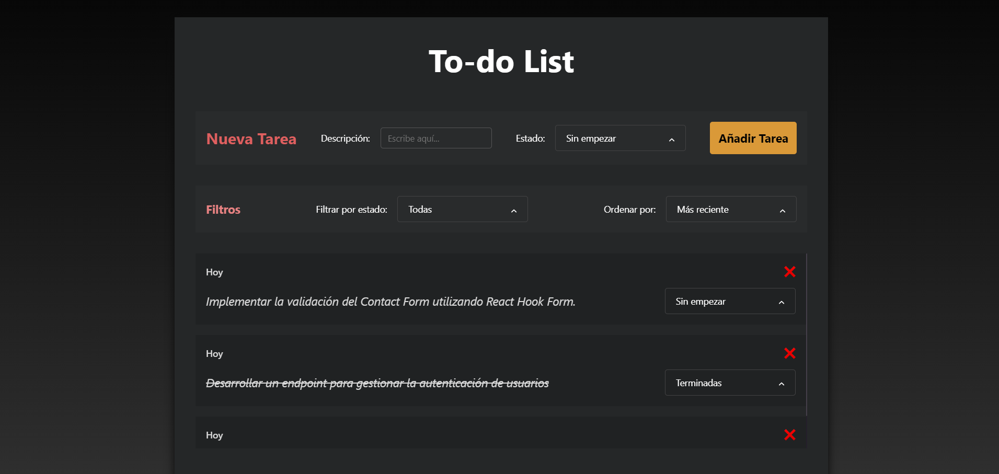
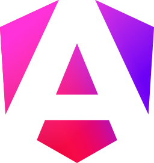
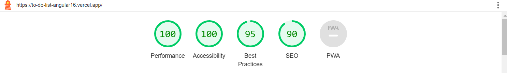

# To-do List with Angular16

 

  

 

**DEPLOY**:
 
https://to-do-list-angular16.vercel.app/

 
 

# Index

1. [Project title and deploy link](#to-do-list-with-angular16)

2. [Features](#features)

3. [Technologies and Tools used](#technologies-and-tools-used)

4. [Project status](#project-status)

5. [Project installation](#project-installation)

6. [Contribution](#contribution)

7. [Project developer](#project-developer)

 
 

## Features

    ✔️ CREATE a new Task with a DESCRIPTION and STATUS (Sin empezar, En proceso o Terminadas). Once created, display its DATE, DESCRIPTION, and STATUS in the LIST.

    ✔️ DELETE a task.

    ✔️ UPDATE the STATUS of a TASK.

    ✔️ FILTER by STATUS (Todas, Sin empezar, En proceso o Terminadas).

    ✔️ SORT by Most recent or Oldest.
    

 

## Technologies and Tools used

   
  
  
  
   
   
  
  
   
   
  
  
  

 
 

## Lighthouse results

  

 

## Project status

 

 

## Project installation

This project was generated with [Angular CLI](https://github.com/angular/angular-cli) version 16.0.0.

## Development server

Run `ng serve` for a dev server. Navigate to `http://localhost:4200/`. The application will automatically reload if you change any of the source files.

## Code scaffolding

Run `ng generate component component-name` to generate a new component. You can also use `ng generate directive|pipe|service|class|guard|interface|enum|module`.

## Build

Run `ng build` to build the project. The build artifacts will be stored in the `dist/` directory.

## Running unit tests

Run `ng test` to execute the unit tests via [Karma](https://karma-runner.github.io).

## Running end-to-end tests

Run `ng e2e` to execute the end-to-end tests via a platform of your choice. To use this command, you need to first add a package that implements end-to-end testing capabilities.

## Further help

To get more help on the Angular CLI use `ng help` or go check out the [Angular CLI Overview and Command Reference](https://angular.io/cli) page.

 

## Contribution

If you want to contribute to this project, follow these steps:

1. Perform a fork to the repository.
 

2. Create a branch for your feature or bugfix: `git checkout -b feature/your-feature-name`
 

3. Make the necessary changes and commits:  `git commit -m 'Add some feature'`
 

4. Push to branch: `git push origin feature/your-feature-name`
 

5. Send a pull request to the original repository.

 

## Project developer

 

| [ Kevin Schans](https://github.com/KevinVanDerSchans) |
:------------------------------------------------------------------------------------------------------------------------------------------: |
